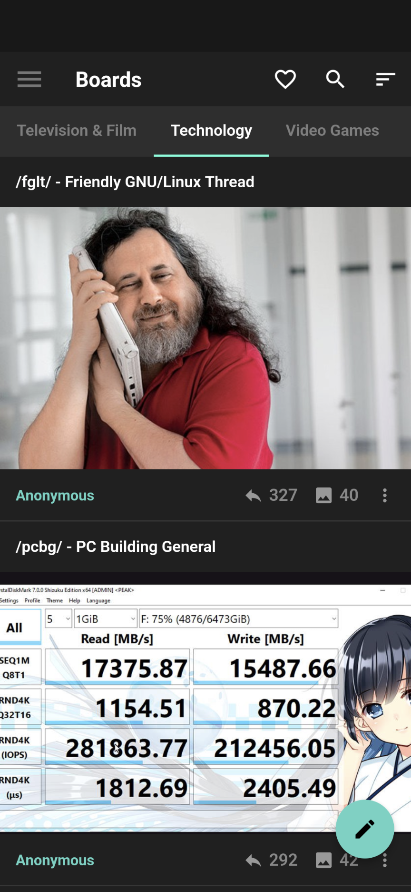

# Mobichan

  
A 4chan app made with Flutter.

## Features

- Browsing boards and threads
- Creating and responding to threads (with an up to date captcha)
- Viewing images
- Playing webms at different speeds
- Sorting and searching threads
- Gallery mode
- Threading
- Localization

## Screenshots

## Contributing

### Localization

- You can add a missing language by creating a json file in `assets/translations`.
- The json file must be named `{languageCode}-{countryCode}.json`.
- Finally, add the line `Locale('{languageCode}', '{countryCode}'),` to the `supportedLocales` array in `main.dart`.
- For further documentation, read [this](https://pub.dev/packages/easy_localization).

## Roadmap

For a detailed roadmap, see [here](https://github.com/Rukkaitto/mobichan/projects/1).
